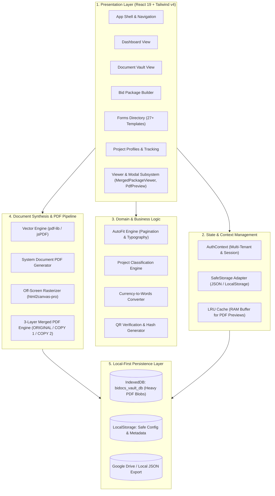

# BiDOCS System Architecture & Technical Blueprint

> **System Standard:** Local-First, Zero-Leak Procurement Document Automation Engine  
> **Statutory Compliance:** Republic Act 9184 & Republic Act 12009 (Philippine Government Procurement Reform Acts)  
> **Paper Standard:** Legal Size (8.5" x 13" / 612pt x 936pt @ 72 DPI / 816px x 1248px @ 96 DPI)

---

## 1. Architectural Overview

BiDOCS is structured as a **Local-First, Zero-External-Dependency Single Page Application (SPA)**. All business logic, government template generators, document compilation pipelines, cryptographic QR codes, and multi-megabyte PDF binaries operate **100% inside the client browser environment**.



---

## 2. Core Architectural Layers

### Layer 1: Presentation & User Interface (`src/components/`)
* **`layout/AppShell.tsx`**: Host frame, navigation sidebar, company switcher, and global actions.
* **`vault/DocumentVaultView.tsx`**: Digital repository for statutory documents (Mayor's Permit, Tax Clearance, DTI/SEC, PCAB License, Audited Financial Statements).
* **`bids/bidpackage.tsx`**: Drag-and-drop dossier assembler. Organizes documents into Technical & Financial envelopes conforming to BAC bid submission checklists.
* **`forms/FormsDirectoryView.tsx`**: Interactive forms library for 27 standard government procurement templates.
* **`vault/MergedPackageViewerModal.tsx`**: 3-Copy synchronized compilation viewer (`ORIGINAL`, `COPY 1`, `COPY 2`) with real-time compilation progress feedback.

---

### Layer 2: State & Session Management (`src/context/` & `src/utils/`)
* **Multi-Tenant Isolation**: Every document, vault item, and opportunity is tagged with `tenantId`. Switching active tenant in `AuthContext` dynamically scopes data queries.
* **`safeStorage.ts`**: Resilient abstraction layer over browser `localStorage` with error handling and quota detection.
* **`lruCache.ts`**: High-performance in-memory LRU cache preventing browser RAM exhaustion when previewing large multi-megabyte PDFs.

---

### Layer 3: Domain & Procurement Compliance (`src/utils/`)
* **`autoFitEngine.ts`**: Dynamic calculation engine that computes table heights, font scales, and pagination boundaries so government forms fit cleanly onto Philippine Legal paper without awkward trailing breaks.
* **`projectClassification.ts`**: Infers contract eligibility, Single Largest Completed Contract (SLCC), and Net Financial Contracting Capacity (NFCC).
* **`qrCodeGenerator.ts`**: Emits verification QR codes containing document SHA hashes, timestamps, and authorized bidder metadata.

---

### Layer 4: The 3-Layer PDF Synthesis Engine (`src/utils/pdfExportEngine.ts`)

The PDF compilation subsystem is governed by **strict architectural constraints**:

```mermaid
sequenceDiagram
    autonumber
    participant UI as MergedPackageViewerModal
    participant Engine as pdfExportEngine
    participant Canvas as html2canvas-pro (-9999px)
    participant PDFLib as pdf-lib (Vector Assembly)
    participant IDB as IndexedDB (Vault Storage)

    UI->>Engine: buildMergedThreeLayerPdfDataUrl(units, fileName, onProgress)
    loop Each Document Unit
        alt Vector Document
            Engine->>IDB: Fetch PDF binary
        else Dynamic HTML Cover/Form
            Engine->>Canvas: Render off-screen DOM element (Legal 816x1248px)
            Canvas-->>Engine: Raw PNG data buffer
        end
        Engine->>PDFLib: Append & Stamp (Header, Footer, Copy Tag, Running Page #)
        Engine->>UI: Emit onProgress({ percent, status })
    end
    PDFLib->>Engine: Final compiled bytes
    Engine->>Engine: blobToDataUrl(blob) [Strict Base64]
    Engine-->>UI: data:application/pdf;base64,...
```

#### Non-Negotiable Rules of the Engine:
1. **Base64 Data URLs Only**: Functions must return `data:application/pdf;base64,...` via `blobToDataUrl`. `URL.createObjectURL` is prohibited because blob URLs get garbage-collected on React re-renders, causing blank iframes.
2. **Fixed Legal Paper Scale**: All pages are strictly sized to Philippine Legal standard:
   * **Portrait**: `[612, 936]` pt
   * **Landscape**: `[936, 612]` pt
3. **Off-Screen Isolation**: Dynamic HTML elements rendered by `html2canvas-pro` must sit in containers with `style={{ left: '-9999px', top: '0px', width: '816px', zIndex: -1 }}` to ensure complete vector fidelity.

---

### Layer 5: Storage & Persistence Engine (`src/utils/vaultIndexedDB.ts`)

To avoid the 5MB browser `localStorage` cap, BiDOCS utilizes a split storage strategy:

| Data Type | Target Storage | Max Capacity | Purpose |
|:---|:---|:---|:---|
| **PDF Binaries & Scans** | IndexedDB (`bidocs_vault_db`) | 200MB - 1GB+ | Scanned permits, uploaded certificates, completed bid PDFs |
| **Document Metadata & Config** | IndexedDB + `localStorage` | Fast synchronous read | File names, categories, expiration dates, active tenant |
| **Temporary Previews** | In-Memory `lruCache.ts` | Dynamic (RAM) | Active tab rendering without disk latency |
| **System Backup & Export** | JSON / Drive File (`.bidocs`) | Unlimited | Manual or cloud sync to Google Drive |

---

## 3. Directory Structure & Code Organization

```
bidocs/
├── ARCHITECTURE.md                  # This document
├── GEMINI.md                        # Critical system constraints & PDF invariants
├── AGENTS.md                        # Multi-agent roles & engineering swarm rules
├── package.json                     # Vite + React 19 + pdf-lib + Tailwind v4
├── src/
│   ├── App.tsx                      # Root component & view router
│   ├── main.tsx                     # React 19 bootstrap entry
│   ├── components/
│   │   ├── auth/                    # Tenant registration & login
│   │   ├── bids/                    # Bid package compiler & dossier view
│   │   ├── covers/                  # Official separator cover templates
│   │   ├── dashboard/               # Metric cards & document status overview
│   │   ├── forms/                   # 27 statutory government forms
│   │   ├── layout/                  # Shell, sidebar, header
│   │   ├── opportunities/           # PhilGEPS opportunity tracker
│   │   ├── projects/                # Project profiles & SLCC records
│   │   ├── settings/                # Tenant settings & data wipe controls
│   │   └── vault/                   # Document vault & 3-layer PDF modal
│   │       └── templates/           # Specific form TSX implementations
│   ├── context/
│   │   └── AuthContext.tsx          # Multi-tenant state & user context
│   ├── types/
│   │   └── index.ts                 # Unified TypeScript interfaces
│   └── utils/
│       ├── autoFitEngine.ts         # Typography & table pagination auto-fit
│       ├── lruCache.ts              # PDF RAM cache
│       ├── pdfExportEngine.ts       # 3-layer PDF compilation engine
│       ├── systemDocumentPdfGenerator.ts # Vector PDF generator for 27 forms
│       └── vaultIndexedDB.ts        # IndexedDB storage layer
```

---

## 4. How to Extend & Modify the System

### Adding a New Document Template
1. Create the visual component in `src/components/vault/templates/YourTemplate.tsx`.
2. Ensure the root DOM element specifies a unique ID (e.g. `id="template-your-form"`).
3. If generating vector PDF without DOM rendering, add the generator function in `src/utils/systemDocumentPdfGenerator.ts`.
4. Register the new form in `src/components/forms/FormsDirectoryView.tsx`.
5. Run `npx tsc --noEmit` to verify type safety across the application.
